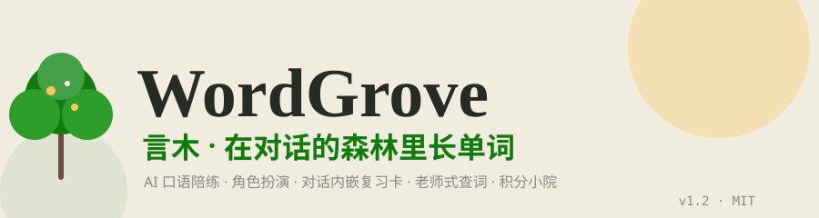

<p align="center">
  
</p>

<p align="center">
  <a href="https://github.com/zhangs1r/wordgrove/blob/main/LICENSE"></a>
  
  
  
  
  <a href="https://github.com/zhangs1r/wordgrove/releases"></a>
</p>

> **单词如树，在对话的森林里生长。**
>
> WordGrove（言木）是一个安卓英语学习 App：**在真实对话里学单词，学了立刻用出来，用了就长进小院里**。
> 不发布、不竞争，只求自己好用——但如果你想拿去用，MIT 协议随便玩。

---

## ✨ 核心亮点

- **🗣️ AI 口语陪练**：DeepSeek 官方 API（国内直连），对话按**你的英语水平**调节词汇难度（CET-4/6、考研、雅思、托福、自如交流），聊 6 轮自动复盘：纠错、收生词、角色感评分
- **🎭 角色扮演剧场**：世界卡 + 角色表，每个角色一个**子 Agent 独立推理内心活动**（内心→行动→台词），导演 Agent 汇总推进剧情 + 3-4 个分支选项，全程全英语，中文输入自动翻译
- **🃏 对话内嵌复习卡**：AI 回复里出现"该复习的词"（SRS 间隔重复到期）→ 消息下方自动弹卡：忘了/模糊/记得，评级后展开释义巩固。防骚扰：每轮最多 2 张、同词一会话只弹一次
- **📖 老师式查词**：点消息里的单词，AI **结合整句语境**讲解——识别固定搭配（搭配另一部分离得远也能找到）、词族、举一反三、词根词缀、记忆提示，例句难度匹配你的水平
- **🏡 积分小院**：学习行为赚积分（对话/查词/复习/复盘/时长），当天积分进度决定植物生长（学得多长得快），买装饰自由摆放（旋转/缩放/图层），跨月封存成历史院子，积分可跨月累积
- **🔊 完全离线 TTS**：内置 Piper 神经语音（美音），Web Worker 合成不卡 UI，读过的句子自动缓存秒播；角色按性别自动分配男/女声
- **🔁 完整学习闭环**：对话用错 → 自动入生词本 → SRS 排期 → 对话里 AI 自然带出巩固 → 复习卡评级 → 小院收获

## 📱 功能总览

| Tab | 功能 |
|-----|------|
| **今日** | SVG 家园大图（房子 + 门前小树随当天积分进度生长）、数据看板（学词/局数/连击/API 余额）、忘词榜/表达榜/错误榜、本月限定装饰预览 |
| **对话** | AI 口语陪练（词汇难度按水平）、表达建议卡（更地道的说法）、中文求助（中文→地道英文）、每 6 轮自动复盘、多会话管理（重命名/删除/切换）、消息操作（朗读/查词/查句/回滚/重新生成） |
| **剧场** | 世界卡 CRUD + AI 生成（自动带角色表）、选角（AI 推荐 3-4 个身份或自定义）、多角色子 Agent 推理、导演推进 + 分支选项、绘画持久化（切回恢复音色/选项/角色） |
| **笔记本** | 生词本（详情：词根/搭配/同反义/词族/记忆提示/来源场景）、一键建卡（粘贴英文提取生词）、句子本（标签分类）、易忘词系统 |
| **小院** | 整页像素农场（16 张季节背景按月份匹配）、64 个装饰素材（12 个月限定 + 16 通用）、装饰自由摆放（旋转/缩放/图层/全局库存）、月积分经济系统、历史院子回看 |
| **设置** | DeepSeek API 配置（模型/测试连接/余额）、**英语水平档位**、复习卡开关、TTS 语速/音色/缓存、备份导入导出、检查更新（启动自动检查） |

## 🧠 智能设计

- **agent loop**（参考 Pi 模式）：模型可调用本地工具（查词/加词/标记掌握/复习队列/读画像），对话直接驱动学习闭环
- **遗忘曲线三件套**：常忘词（稳定带进对话）、沉淀词（30% 概率随机重现）、今天 SRS 到期词（优先自然使用）——都在提示词里作为"可选素材"，符合语境才用，违和宁可不塞
- **DeepSeek 缓存友好**：RP 系统提示词前缀保持稳定，命中官方上下文硬盘缓存（价格差 50 倍）
- **积分防刷**：幂等键 + 每日次数上限 + 全局 50 分日上限 + 时长防挂机（忽略键盘自动重复）

## 🛠 技术栈

| 部分 | 方案 |
|------|------|
| 前端 | 纯 HTML + JS + CSS（单页应用，无框架） |
| 打包 | Capacitor 7 → Android APK（`CapacitorHttp` 绕 CORS） |
| AI | DeepSeek 官方 API（`deepseek-v4-flash`，思考模式，国内直连） |
| 离线 TTS | onnxruntime-web + Piper（en_US-kristin / joe 双音色，Web Worker） |
| 存储 | IndexedDB（生词/小院）+ localStorage（设置/会话，`ea_` 前缀） |
| 复习算法 | SM-2 间隔重复（忘了/模糊/记得三档评级） |

## 🎨 设计系统

麻纸手账 × 草木生长：
- 日间：麻纸米白 `#F1ECE0` 底 / 草木深绿 `#117C0D` 主操作 / 麦秆暖黄 `#FAC75E` 成就感
- 夜间：深炭绿黑 `#141810` 底，纸墨反转（日间底色 = 夜间文字色）
- 字体：英文 Inter / 中文 Noto Sans SC / 品牌 Noto Serif SC
- 动效：弹簧曲线 `cubic-bezier(0.34, 1.56, 0.64, 1)`

## 🚀 构建（Android）

```bash
# 前置：JDK 21 + Android SDK + Node.js
export JAVA_HOME=~/jdk21 ANDROID_HOME=~/android-sdk
cd wordgrove
npx cap sync android
cd android && ./gradlew assembleDebug --no-daemon
# 输出：android/app/build/outputs/apk/debug/app-debug.apk
```

> 注意：构建时不要设 HTTP 代理（gradle 走阿里云镜像直连）。

## ⚙️ 使用

1. 安装 APK（[Releases 页下载](https://github.com/zhangs1r/wordgrove/releases)）
2. 设置页填入 DeepSeek API Key（[platform.deepseek.com](https://platform.deepseek.com) 注册充值，10 元能用很久）
3. 选好英语水平，开始聊第一句

## 💾 数据与备份

- 所有数据都在本地（生词/会话/小院/设置），无账号无云同步
- 设置 → 数据 → 导出备份（含词库/画像/小院/会话/句子/表达/世界卡），导入自动校验（数值钳制防脏数据）
- 降级方案：检查更新 → 下载安装包覆盖安装，数据不丢

## 📋 更新日志

- **v1.2**：查词升级（带语境识别固定搭配、老师式讲解：语境用法/词族/举一反三/记忆提示）；英语水平档位（CET4/6/考研/雅思/托福/自如，对话/剧场/查词都按此调词汇难度）；复习卡可开关；修复 RP 话题记录被普通对话覆盖的 bug；RP 话题命名去重；今日页 SVG 小房子（门前小树随当天积分进度生长）；植物生长改为当天积分进度驱动；新手指引；启动自动检查更新
- **v1.1**：对话内嵌复习卡（复习功能融入对话流）；积分 maxDay 语义修复（按次数统计，各来源奖励恢复设计值）；RP 异常路径大修（rpBusy 死锁/JSON 兜底/卡司持久化/切换守卫/重生成修复）；TTS 连点卡死修复；会话 40 条 LRU 上限；备份导入校验+导出补全；移除开发者设置面板
- **v1.0**：装饰扩充 64 素材（每月 4 个限定 + 16 通用）；积分系统落地（每日 50 上限、跨月累积、复习给分）；植物格子独立生长；SRS 到期词进对话上下文
- **v0.1 → v0.44**：核心闭环从零搭建——对话陪练/复盘/SM-2 复习/生词本/离线 TTS/世界卡角色扮演/多角色子 Agent/月积分小院/像素农场/装饰系统

## 🗺 路线图

- [x] AI 对话陪练 + 复盘收词闭环
- [x] 酒馆角色扮演（多角色子 Agent + 导演）
- [x] 离线 Piper TTS 双音色
- [x] 积分小院 + 装饰系统 + 月历花园
- [x] 对话内嵌复习卡（复习融入对话）
- [x] 老师式查词（语境/搭配/举一反三）
- [ ] 素材动态化（风车/萤火虫罐/篝火动画帧）
- [ ] 季节粒子效果（萤火虫/落叶/飘雪）
- [ ] iOS 移植（Capacitor 支持，需 Mac + Xcode + 开发者账号）

## 🙏 素材署名

- 作物 sprite：LPC Crops（[CC-BY-SA 4.0](https://opengameart.org/content/lpc-crops)）
- 草地 sprite：Town & Nature（[CC0](https://opengameart.org/content/town-nature)）
- 装饰 sprite：AI 生成 + perfectPixel 像素校正

## 📄 协议

[MIT License](LICENSE) © 2026 zhangs1r

---

<p align="center"><sub>Made with ❤️ for learning English · 在对话的森林里，每棵树都来自你开口说的那句话</sub></p>
